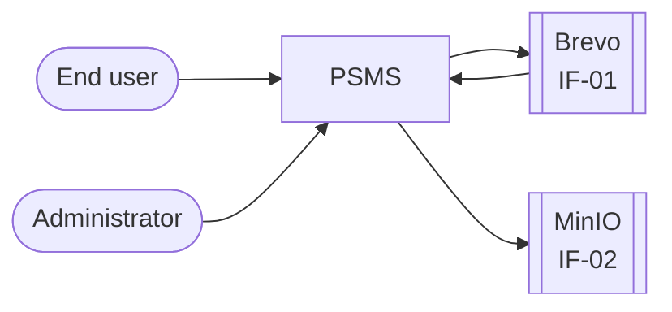
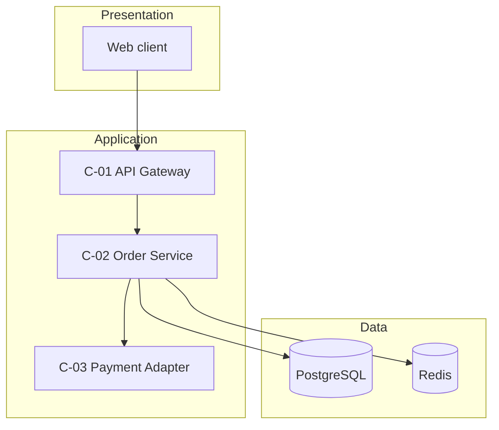
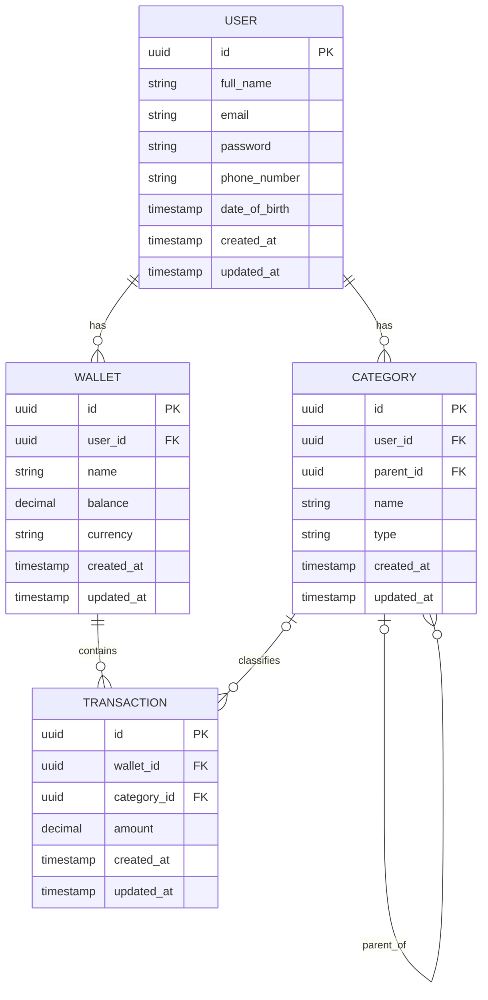
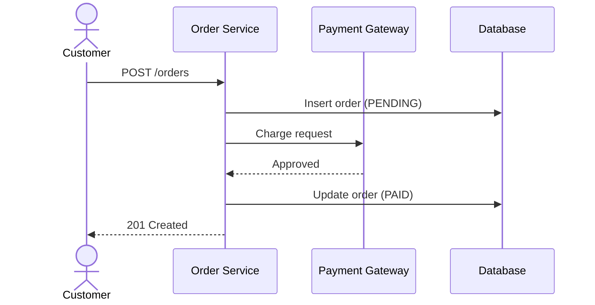

# System Design Document (SDD) — Simple Template

This template gives the development team the information that it needs to build the system. It has 7 sections. The
standard CMS template has 11 sections. This template puts the same content in fewer places.

Write this document in Simplified Technical English (ASD-STE100). Keep sentences short. Use the active voice. Use one
word for one meaning.

---

## How to Use This Template

1. Copy this file into the repository of your project.
2. Replace each `<placeholder>` with your text.
3. If a section does not apply to your project, write "Not applicable" and the reason.
4. Do not erase a heading. Reviewers read the document by section number.
5. Erase each "What to write" list before you baseline the document.

**NOTE:** A "baseline" is the first approved version. After the baseline, all changes need a new version number and a
new row in the revision history.

---

## Document Information

| Item           | Value                                 |
|----------------|---------------------------------------|
| System name    | `Personal Finance Management System`  |
| Version        | `0.1`                                 |
| Status         | Draft                                 |
| Release        | `1.0`                                 |
| Date           | `2026-08-28`                          |
| Author         | `Hoàng Thanh Diệu, Backend`           |
| Approver       | `Nguyễn Thành Kiên, Software Engineer`|
| Classification | Internal                              |

## Revision History

| Version | Date | Author | Sections | Change        |
|---------|------|--------|----------|---------------|
| 0.1     |      |        | All      | First version |
|         |      |        |          |               |

---

# 1. Introduction

## 1.1 Purpose and Scope

**What to write:**

- Give one sentence that tells what this document does.
- List the parts of the system that this document covers.
- List the parts that this document does not cover.
- If the team builds the system in more than one release, name the release.

**Example:**

> This document describes the design of the Order Service, release 1.0. It covers the API, the database, and the
> interface to the Payment Gateway. It does not cover the mobile client. The mobile client has a separate design document.

## 1.2 Audience

| Reader                  | Sections to read   |
|-------------------------|--------------------|
| Project manager         | 1, 2, 3            |
| Developer               | 4, 5, 6            |
| Database administrator  | 5                  |
| Infrastructure engineer | 4.4, 7             |
| Security engineer       | 3.2, 7.2, 7.3      |
| Tester                  | 6, 7.1, Appendix A |

## 1.3 Referenced Documents

**What to write:** List each document that you used to make this design. Give a link to each one.

| ID     | Document              | Version | Link |
|--------|-----------------------|---------|------|
| REF-01 | Requirements Document |         |      |
| REF-02 | Logical Data Model    |         |      |
| REF-03 | `<other>`             |         |      |

---

# 2. System Overview

## 2.1 Background

**What to write:**

- Describe the business problem in two or three sentences.
- Describe the limits of the current system, if a current system exists.
- Give the reason to build the new system now.

## 2.2 Functions

**The system does these functions:**

1. `<function 1>`
2. `<function 2>`

**The system does not do these functions:**

1. `<function that a different system does>`
2. `<function that a later release does>`

**NOTE:** The second list prevents disagreement later. Write it with care.

## 2.3 Context Diagram



---

# 3. Design Decisions

## 3.1 Assumptions and Dependencies

**What to write:** An assumption is a fact that you believe but cannot prove now. A dependency is an item from a
different team.

| ID    | Type       | Statement                                           | Result if the statement is false         | Owner |
|-------|------------|-----------------------------------------------------|------------------------------------------|-------|
| AS-01 | Assumption | The peak load is less than 500 requests per second. | The design needs more application nodes. |       |
| DP-01 | Dependency | The network team opens port 5432.                   | The service cannot reach the database.   |       |

## 3.2 Constraints

**What to write:** A constraint is a limit that you cannot change. Write only the constraints that change your design.

| Area          | Constraint                                           | Effect on the design |
|---------------|------------------------------------------------------|----------------------|
| Technology    | `<the company approves only Java 21 and PostgreSQL>` |                      |
| Security      | `<all traffic uses TLS 1.3>`                         |                      |
| Legal         | `<personal data stays inside Vietnam>`               |                      |
| Budget        | `<maximum 6 virtual machines>`                       |                      |
| Time          | `<the release date is fixed>`                        |                      |
| Compatibility | `<the old API stays available until 2027>`           |                      |

## 3.3 Quality Targets

**What to write:** Give a number for each target. A target without a number is not a target.

| Property            | Target                  | Method of measurement      |
|---------------------|-------------------------|----------------------------|
| Response time (p95) | less than 300 ms        | `<dashboard, metric name>` |
| Throughput          | 500 requests per second |                            |
| Concurrent users    | 2000                    |                            |
| Availability        | 99.9 percent each month |                            |
| RPO                 | 15 minutes              |                            |
| RTO                 | 1 hour                  |                            |
| Data retention      | 5 years                 |                            |

**Definitions:** RPO is the maximum quantity of data that you can lose. RTO is the maximum time to make the system
available again.

## 3.4 Decision Records

**What to write:** Write one record for each important decision. A decision is important when a change to it changes the
architecture.

| ID      | Decision                        | Status   | Date |
|---------|---------------------------------|----------|------|
| ADR-001 | `<use PostgreSQL, not MongoDB>` | Accepted |      |

**Template for one record:**

```markdown
### ADR-001: <title>

- **Status:** Proposed / Accepted / Replaced by ADR-00X
- **Problem:** <what you must decide, and why it is necessary>
- **Options:** <option A>, <option B>
- **Decision:** <the option that you select>
- **Reason:** <why this option is better than the other options>
- **Result:** <what becomes easier, and what becomes more difficult>
```

---

# 4. Architecture

## 4.1 Components

**What to write:** List each component. A component is a part of the system that a team can build and deploy alone.

| ID   | Component       | Responsibility                         | Depends on |
|------|-----------------|----------------------------------------|------------|
| C-01 | API Gateway     | Accepts requests. Does authentication. | C-02       |
| C-02 | Order Service   | Creates and updates orders.            | C-03, DB   |
| C-03 | Payment Adapter | Sends payments to the Payment Gateway. | IF-01      |

**Reason for this division:**
`<explain why you divide the system in this way. Name one different division and the reason to reject it.>`

## 4.2 Architecture Diagram



**NOTE:** Give each box the same ID as the table in section 4.1. The ID connects the diagram to the text.

## 4.3 Technology Stack

| Item             | Product | Version | License | Reason |
|------------------|---------|---------|---------|--------|
| Language         |         |         |         |        |
| Framework        |         |         |         |        |
| Database         |         |         |         |        |
| Cache            |         |         |         |        |
| Message broker   |         |         |         |        |
| Operating system |         |         |         |        |

## 4.4 Infrastructure and Resources

**What to write:** Show where each component operates. Give a number for CPU, memory, and disk.

| Component | Environment | Instances            | CPU | Memory | Disk   |
|-----------|-------------|----------------------|-----|--------|--------|
| C-01      | PROD        | 2                    | 1   | 2 GB   | 10 GB  |
| C-02      | PROD        | 3                    | 2   | 4 GB   | 20 GB  |
| Database  | PROD        | 1 primary, 1 replica | 4   | 16 GB  | 500 GB |

**Network paths:**

| From     | To       | Port | Protocol | Encryption |
|----------|----------|------|----------|------------|
| Internet | C-01     | 443  | HTTPS    | TLS 1.3    |
| C-01     | C-02     | 8080 | HTTP     | mTLS       |
| C-02     | Database | 5432 | TCP      | TLS        |

## 4.5 Component Detail

**What to write:** Complete one table for each component in section 4.1. Keep it short. The source code gives the
remainder of the detail.

```markdown
### C-01: <component name>

| Attribute | Content |
|---|---|
| **Type** | service / library / job / user interface |
| **Language** | |
| **Purpose** | <one sentence> |
| **Interfaces** | <the operations that this component makes available to other components> |
| **Dependencies** | <the components, databases, and external systems that it needs> |
| **Constraints** | <limits on time, memory, or state. Also give the conditions before and after each operation.> |
| **Failure behavior** | <what the component does when a dependency does not answer> |
| **Requirements** | <the requirement IDs that this component satisfies> |
```

---

# 5. Data Design

## 5.1 Data Model



## 5.2 Tables and Indexes

| Table    | Purpose | Primary key | Index                    | Query that the index serves      |
|----------|---------|-------------|--------------------------|----------------------------------|
| `transactions` | Storing transactions of all users | `id`        | `idx_transactions_wallet_id` | Find all transactions of one wallet. |
| `transactions` | Storing transactions of all users | `id`        | `idx_transactions_wallet_id_created_at` | Find all transactions of one wallt whitin a time range |

**Rule:** Each index needs a query. If no query needs the index, erase the index.

## 5.3 Data Volume

**What to write:** Give the quantity of rows at the start, and the growth each month. Storage costs and query time both
depend on these numbers.

| Table    | Rows at the start | Growth each month | Row size  | Size after 3 years |
|----------|-------------------|-------------------|-----------|--------------------|
| `orders` | 0                 | 100,000           | 500 bytes | 18 GB              |

## 5.4 Files Outside the Database

| File or bucket   | Purpose          | Format | Written by     | Read by      | Retention |
|------------------|------------------|--------|----------------|--------------|-----------|
| `s3://exports/`  | Daily reports    | CSV    | Report job     | End user     | 90 days   |
| Application logs | Problem analysis | JSON   | All components | Support team | 30 days   |

## 5.5 Backup and Recovery

| Item             | Specification                         |
|------------------|---------------------------------------|
| Backup type      | Full each week. Incremental each day. |
| Schedule         | 02:00 ICT                             |
| Storage location | `<different region>`                  |
| Retention        | 30 days                               |
| Encryption       | AES-256                               |
| Recovery test    | Each quarter                          |

**CAUTION:** A backup without a recovery test is not a backup. Do a recovery test each quarter and record the result.

---

# 6. Interfaces

## 6.1 User Classes

**What to write:** A user class is a group of people who use the system in the same way.

| User class    | Task                   | Total users | Concurrent users | External |
|---------------|------------------------|-------------|------------------|----------|
| Customer      | Makes orders.          | 50,000      | 2,000            | Yes      |
| Operator      | Corrects order data.   | 20          | 5                | No       |
| Administrator | Configures the system. | 3           | 1                | No       |

## 6.2 Screens and Input Data

| Screen ID | Name       | User class | Purpose              |
|-----------|------------|------------|----------------------|
| SCR-01    | Order form | Customer   | Creates a new order. |

**Validation rules for SCR-01:**

| Field      | Type    | Length | Necessary | Permitted values | Error message                       |
|------------|---------|--------|-----------|------------------|-------------------------------------|
| `email`    | text    | 255    | Yes       | RFC 5322 format  | "The email address is not correct." |
| `quantity` | integer | —      | Yes       | 1 to 100         | "Give a quantity from 1 to 100."    |

**CAUTION:** The client does the same validation as the server, but the client validation is not sufficient. An attacker
can send a request directly to the API. Do all validation again on the server.

**Accessibility:** Obey WCAG 2.1 level AA. Make sure that a user can operate each screen with the keyboard alone.

## 6.3 Outputs

| ID     | Name               | Type     | Content | Users   | Frequency         | Access limits     |
|--------|--------------------|----------|---------|---------|-------------------|-------------------|
| OUT-01 | Daily sales report | CSV file |         | Manager | Each day at 07:00 | Manager role only |

## 6.4 Internal API

| ID     | Method and path | Purpose           | Request        | Response        | Errors        | Authentication |
|--------|-----------------|-------------------|----------------|-----------------|---------------|----------------|
| API-01 | `POST /orders`  | Creates an order. | `OrderRequest` | `OrderResponse` | 400, 401, 409 | Bearer token   |

**Error codes:**

| Code      | HTTP status | Meaning                             | Correction                    |
|-----------|-------------|-------------------------------------|-------------------------------|
| `WAL-001` | 404         | The wallet is not found.      | Send an existed id.      |
| `TRX-001` | 400         | The transaction amount is bigger than wallet balance. | Use a smaller amount. |
| `USR-001` | 409         | The register email is already exists. | Use a non register email. |

## 6.5 External Systems

| ID    | System          | Owner      | Direction | Type     | Frequency        |
|-------|-----------------|------------|-----------|----------|------------------|
| IF-01 | Payment Gateway | `<vendor>` | Both      | REST API | Each transaction |

**Detail for IF-01:**

| Item           | Specification                                              |
|----------------|------------------------------------------------------------|
| Data format    | JSON                                                       |
| Authentication | mTLS and an API key                                        |
| Timeout        | 5 seconds                                                  |
| Retry          | 3 times, with an interval of 1, 2, and 4 seconds           |
| Idempotency    | The request contains the header `Idempotency-Key`.         |
| Error report   | The system writes the error to the log and sends an alert. |
| Reconciliation | The system compares the totals each day at 23:00.          |
| Contact        | `<name, email>`                                            |

**NOTE:** An external system can stop at any time. Section 4.5 gives the failure behavior of each component.

---

# 7. Operations and Security

## 7.1 Operational Scenarios

**What to write:** Write one scenario for each main function. A scenario shows the sequence of steps from the start to
the end.

### SC-01: A customer makes an order

- **Actor:** Customer
- **Precondition:** The customer has an account and one or more items in the cart.
- **Trigger:** The customer selects the "Pay" button.
- **Volume:** 300 transactions each hour. In the peak hour, 1,200 transactions.

| Step | Actor    | Action                        | System response                                        |
|------|----------|-------------------------------|--------------------------------------------------------|
| 1    | Customer | Sends the order.              | The system stores the order with the status `PENDING`. |
| 2    | System   | Sends the payment to IF-01.   | The gateway answers with an approval.                  |
| 3    | System   | Updates the status to `PAID`. | The system sends a confirmation email.                 |

**Alternative flows:**

| ID | Condition                                 | Result                                                                |
|----|-------------------------------------------|-----------------------------------------------------------------------|
| E1 | The gateway refuses the payment.          | The status becomes `FAILED`. The system shows an error message.       |
| E2 | The gateway does not answer in 5 seconds. | The system retries 3 times. Then the status becomes `PENDING_REVIEW`. |



## 7.2 Access Control

| Data or operation | Customer     | Operator     | Administrator        |
|-------------------|--------------|--------------|----------------------|
| Own order         | Create, read | Read, update | Read                 |
| All orders        | —            | Read, update | Read                 |
| User accounts     | Read own     | —            | Create, read, update |
| Configuration     | —            | —            | Create, read, update |

**Rules:**

- Give each role only the access that its tasks need.
- The server does all authorization. The user interface hides buttons, but this is not a control.
- Encrypt personal data in the database at the field level.
- Replace personal data with a mask in all logs.

## 7.3 Audit Records

**What to write:** An audit record shows who changed which data, and when.

Each audit record contains these fields:

| Field                  | Example                |
|------------------------|------------------------|
| User ID                | `usr_10293`            |
| Source IP              | `203.0.113.7`          |
| Date and time (UTC)    | `2026-08-27T09:14:22Z` |
| Operation              | `UPDATE order.status`  |
| Data before the change | `PENDING`              |
| Data after the change  | `PAID`                 |
| Result                 | Success or failure     |
| Trace ID               | `4bf92f...`            |

**Retention:** 5 years. Write audit records to storage that nobody can change.

## 7.4 Monitoring and Alerts

| Signal            | Threshold                         | Alert to            | Action                                       |
|-------------------|-----------------------------------|---------------------|----------------------------------------------|
| Error rate 5xx    | more than 1 percent for 5 minutes | On-call engineer    | Read the log. Find the component that fails. |
| Response time p95 | more than 300 ms for 10 minutes   | On-call engineer    | Examine the database and the cache.          |
| Disk usage        | more than 80 percent              | Infrastructure team | Increase the disk.                           |

## 7.5 Deployment and Rollback

1. Deploy to the UAT environment first.
2. Do the test suite. Make sure that all tests pass.
3. Deploy to production with a rolling update.
4. Make sure that the health endpoint answers for 10 minutes.
5. If the error rate increases, start the rollback procedure.

**Rollback procedure:** Deploy the previous version. Then apply the down migration of the database, if a down migration
exists.

**CAUTION:** A database migration that erases a column has no rollback. Erase a column only in a later release, after
the new code operates without it.

---

# Appendix A — Requirements Traceability Matrix

**What to write:** Show that the design satisfies each requirement. The tester uses this table.

| Requirement ID | Description | Section  | Component | Test case | Status  |
|----------------|-------------|----------|-----------|-----------|---------|
| REQ-001        |             | 4.1, 6.4 | C-02      | TC-001    | Covered |
| REQ-002        |             |          |           |           | Open    |

# Appendix B — Glossary

| Term        | Definition                                                                       |
|-------------|----------------------------------------------------------------------------------|
| Component   | A part of the system that a team can build and deploy alone.                     |
| Baseline    | The first approved version of a document.                                        |
| RPO         | Recovery Point Objective. The maximum quantity of data that you can lose.        |
| RTO         | Recovery Time Objective. The maximum time to make the system available again.    |
| Idempotency | The property that lets a client send the same request two times with one result. |
| `<term>`    |                                                                                  |

---

# Checklist Before the Baseline

- [ ] Each section has content, or the words "Not applicable" and a reason.
- [ ] Each diagram uses the same IDs as the tables.
- [ ] Each requirement is in Appendix A.
- [ ] Each component in section 4.1 has a detail table in section 4.5.
- [ ] Each external system in section 6.5 has a detail table.
- [ ] Each quality target in section 3.3 has a number.
- [ ] The team did an internal review and recorded the comments.
- [ ] The document is in the repository, with a version number.

---

**Language standard:** This template uses the rules of ASD-STE100 Simplified Technical English (Issue 9). Sentences in
instructions have 20 words or less. Sentences in descriptions have 25 words or less. Full compliance needs the official
dictionary. The standard is a free download at asd-ste100.org.
