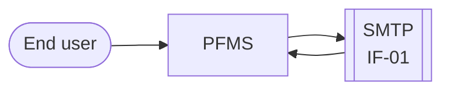
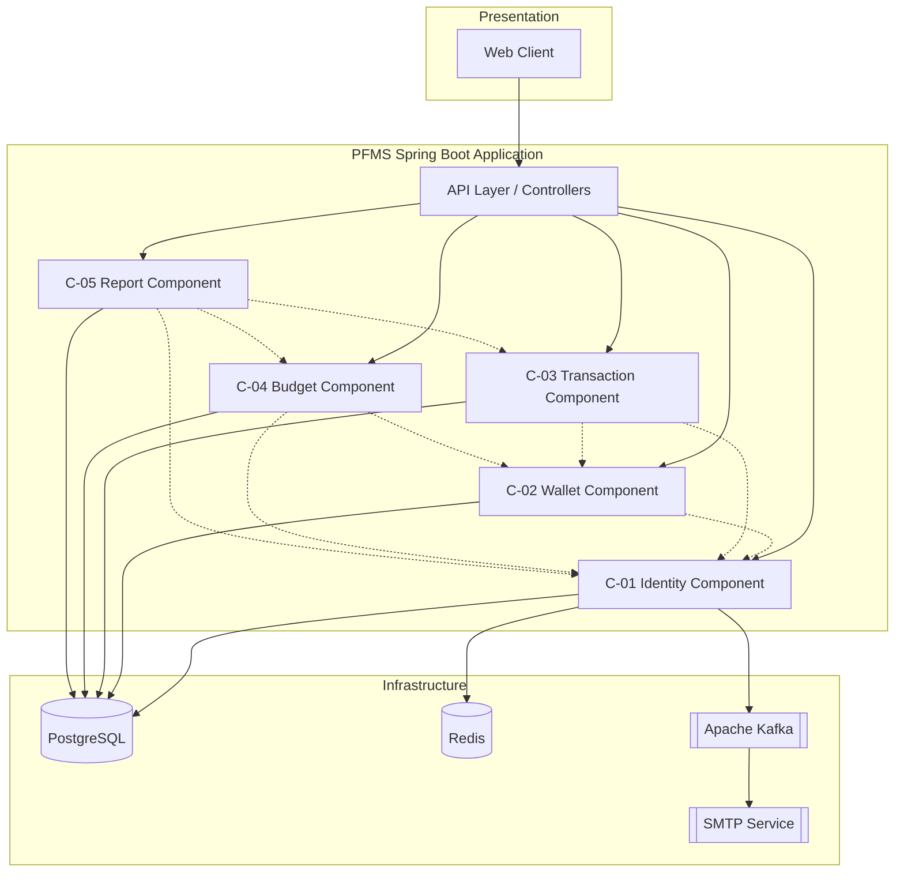
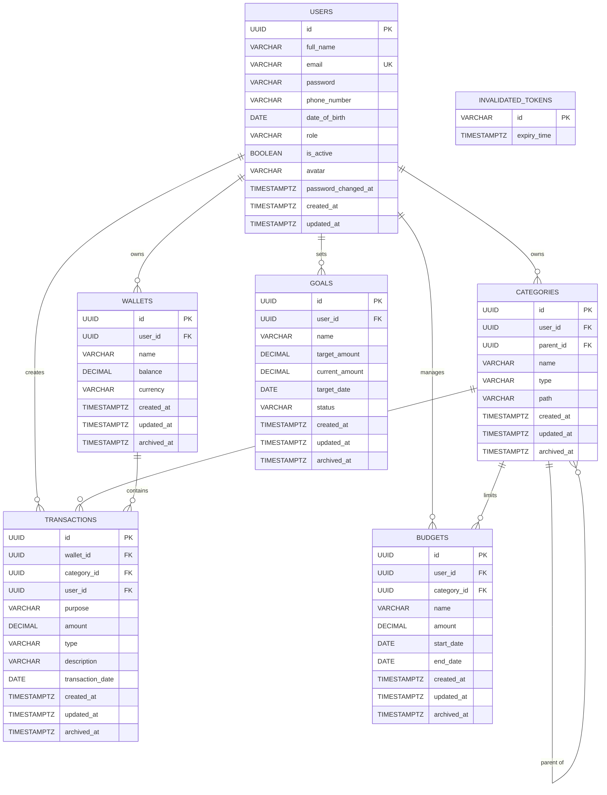
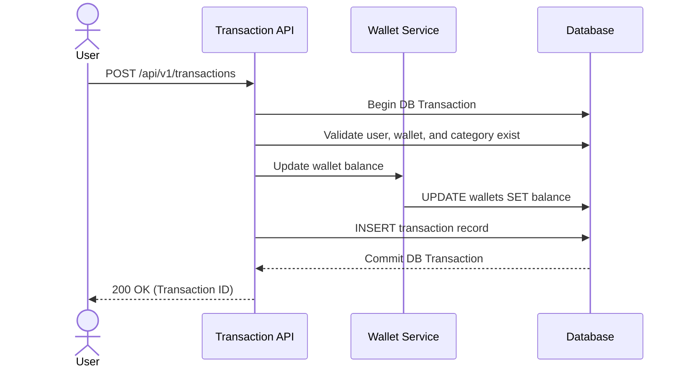

## Document Information

| Item           | Value                                  |
|----------------|----------------------------------------|
| System name    | `Personal Finance Management System`   |
| Version        | `0.1`                                  |
| Status         | Draft                                  |
| Release        | `1.0`                                  |
| Date           | `2026-08-28`                           |
| Author         | `Hoàng Thanh Diệu, Backend`            |
| Approver       | `Nguyễn Thành Kiên, Software Engineer` |
| Classification | Internal                               |

## Revision History

| Version | Date | Author | Sections | Change        |
|---------|------|--------|----------|---------------|
| 0.1     |      |        | All      | First version |
|         |      |        |          |               |

---

# 1. Introduction

## 1.1 Purpose and Scope

> This document describes the design of the Personal Finance Management System API, release 1.0.
> It covers user authentication, wallet and category management, transaction processing, budgeting, and financial
> reports.
> It does not cover front-end client applications

## 1.2 Audience

| Reader                  | Sections to read   |
|-------------------------|--------------------|
| Project manager         | 1, 2, 3            |
| Developer               | 4, 5, 6            |
| Database administrator  | 5                  |
| Infrastructure engineer | 4.4, 7             |
| Security engineer       | 3.2, 7.2, 7.3      |
| Tester                  | 6, 7.1, Appendix A |

## 1.3 Referenced Documents

| ID     | Document              | Version | Link                          |
|--------|-----------------------|---------|-------------------------------|
| REF-01 | Requirements Document | 1.0     | `docs/requirements.md`        |
| REF-02 | OpenAPI Specification | 1.0     | `docs/API-Specification.yaml` |

---

# 2. System Overview

## 2.1 Background

- Users need a reliable system to track daily income, expenses, and savings goals. Manual tracking methods cause errors
  and lack clarity.
- This backend system provides RESTful APIs to manage financial data securely and produce reports.

## 2.2 Functions

**The system does these functions:**

1. Authenticates users and manages user profiles
2. Manages categories and user wallets
3. Records transactions
4. Generates CSV transaction reports
5. Tracks spending budgets and savings goals
6. Provides reconciliation reports

**The system does not do these functions:**

1. Direct integration with external commercial bank accounts in release 1.0
2. Processing direct payment transactions between users
3. Upload receipt files (deferred to a later release)
4. Send SMS for reset password

## 2.3 Context Diagram

---

# 3. Design Decisions

## 3.1 Assumptions and Dependencies

| ID    | Type       | Statement                                                        | Result if the statement is false              | Owner        |
|-------|------------|------------------------------------------------------------------|-----------------------------------------------|--------------|
| AS-01 | Assumption | The system has less than 100 concurrent users in the first year. | The database needs a connection pool upgrade. | Backend Team |
| DP-01 | Dependency | The SMTP service permits 500 emails each day.                    | The system cannot send OTPs.                  | Infra Team   |

## 3.2 Constraints

| Area       | Constraint                                         | Effect on the design                           |
|------------|----------------------------------------------------|------------------------------------------------|
| Technology | The system uses Java, Spring Boot, and PostgreSQL. | The team uses Spring Data JPA for data access. |
| Security   | The API uses JWT for stateless authentication.     | The client must store the token safely.        |

## 3.3 Quality Targets

| Property            | Target                  | Method of measurement |
|---------------------|-------------------------|-----------------------|
| Response time (p95) | less than 500 ms        | Application logs      |
| Availability        | 99.9 percent each month | Uptime monitoring     |
| RPO                 | 24 hours                | Daily database backup |
| RTO                 | 4 hours                 | Deployment pipeline   |

**Definitions:** RPO is the maximum quantity of data that you can lose. RTO is the maximum time to make the system
available again.

## 3.4 Decision Records

| ID      | Decision                      | Status   | Date       |
|---------|-------------------------------|----------|------------|
| ADR-001 | `Use PostgreSQL, not MongoDB` | Accepted | 2026-08-26 |

### ADR-001: Use PostgreSQL

- **Status:** Accepted
- **Problem:** The system needs a reliable relational database for users, wallets, categories, transactions, budgets,
  and reports.
- **Options:** PostgreSQL, MongoDB
- **Decision:** Use PostgreSQL
- **Reason:** PostgreSQL provides strong relational data management and transaction support
- **Result:** Data consistency is easier to maintain, but database schema changes require migrations

---

# 4. Architecture

## 4.1 Components

| ID   | Component             | Responsibility                                       | Depends on                 |
|------|-----------------------|------------------------------------------------------|----------------------------|
| C-01 | Identity Component    | Manages user registration, login, and user profiles. | Database                   |
| C-02 | Wallet Component      | Manages categories and user wallets.                 | C-01, Database             |
| C-03 | Transaction Component | Creates transactions and calculates balances.        | C-01, C-02, Database       |
| C-04 | Budget Component      | Manages budgets and financial goals.                 | C-01, C-02, Database       |
| C-05 | Report Component      | Generates reconciliation data and reports.           | C-01, C-03, C-04, Database |

**Reason for this division:**
This division groups functions by business domains. It keeps related logic in one place. We rejected a technical
division (such as controllers, services, and repositories) because it separates related business rules. A domain
division makes future extraction to microservices easier.

## 4.2 Architecture Diagram

**NOTE:** Solid lines (-->) show network or control flow. Dotted lines (-.->) show internal component dependencies.

## 4.3 Technology Stack

| Item             | Product                 | Version       | License            | Reason                                                                   |
|------------------|-------------------------|---------------|--------------------|--------------------------------------------------------------------------|
| Language         | Java                    | 21 LTS        | GPL v2 with CE     | Strong type safety, long-term support, and virtual thread capability.    |
| Framework        | Spring Boot             | 4.1.1         | Apache 2.0         | Fast enterprise application setup and built-in production features.      |
| Database         | PostgreSQL              | 18            | PostgreSQL License | ACID compliance, strong relational integrity, and decimal precision.     |
| Cache            | Redis                   | 7.x           | RSALv2 / SSPLv1    | High-speed in-memory data store for token blacklisting and session data. |
| Message broker   | Apache Kafka            | 4.3.1         | Apache 2.0         | Reliable asynchronous event streaming for notification handling.         |
| Operating system | Linux (Alpine / Debian) | 12 (Bookworm) | GNU GPL            | Lightweight and secure base image for containerized execution.           |

## 4.4 Infrastructure and Resources

| Component                       | Environment | Instances | CPU | Memory | Disk  |
|---------------------------------|-------------|-----------|-----|--------|-------|
| PFMS Application (C-01 to C-05) | PROD        | 1         | 2   | 2 GB   | 20 GB |
| PostgreSQL Database             | PROD        | 1         | 2   | 4 GB   | 50 GB |
| Redis Cache                     | PROD        | 1         | 1   | 1 GB   | 10 GB |
| Apache Kafka                    | PROD        | 1         | 1   | 1 GB   | 10 GB |

**Network paths:**

| From                            | To               | Port | Protocol | Encryption |
|---------------------------------|------------------|------|----------|------------|
| Internet                        | PFMS Application | 443  | HTTPS    | TLS 1.3    |
| PFMS Application (C-01 to C-05) | PostgreSQL       | 5432 | TCP      | None       |
| PFMS Application                | Redis            | 6379 | TCP      | None       |
| PFMS Application                | Apache Kafka     | 9092 | TCP      | None       |
| PFMS Application                | SMTP Service     | 587  | TCP      | STARTTLS   |

## 4.5 Component Detail

### C-01: Identity Component

| Attribute            | Content                                                                                                          |
|----------------------|------------------------------------------------------------------------------------------------------------------|
| **Type**             | Service                                                                                                          |
| **Language**         | Java 21                                                                                                          |
| **Purpose**          | Manages user registration, login, logout, profiles, and password management.                                     |
| **Interfaces**       | Register, login, logout, get profile, update profile, change password, reset password.                           |
| **Dependencies**     | PostgreSQL, Redis, Apache Kafka, SMTP Service                                                                    |
| **Constraints**      | User credentials must be securely stored. Authentication must be completed before accessing protected resources. |
| **Failure behavior** | Returns a standardized error response when authentication or external services fail.                             |
| **Requirements**     | FR-01, FR-02                                                                                                     |

### C-02: Wallet Component

| Attribute            | Content                                                                                                          |
|----------------------|------------------------------------------------------------------------------------------------------------------|
| **Type**             | Service                                                                                                          |
| **Language**         | Java 21                                                                                                          |
| **Purpose**          | Manages user categories and wallets.                                                                             |
| **Interfaces**       | Create, update, delete, list, and view wallet/category details.                                                  |
| **Dependencies**     | Identity Component, PostgreSQL                                                                                   |
| **Constraints**      | Only authenticated users can access their own wallets and categories.                                            |
| **Failure behavior** | Returns a standardized error response when the database is unavailable or the requested resource does not exist. |
| **Requirements**     | FR-03, FR-04                                                                                                     |

### C-03: Transaction Component

| Attribute            | Content                                                                                                                          |
|----------------------|----------------------------------------------------------------------------------------------------------------------------------|
| **Type**             | Service                                                                                                                          |
| **Language**         | Java 21                                                                                                                          |
| **Purpose**          | Manages income and expense transactions and calculates wallet balances.                                                          |
| **Interfaces**       | Create transaction, list transactions, view transaction details, and export CSV reports. |
| **Dependencies**     | Identity Component, Wallet Component, PostgreSQL                                                                                 |
| **Constraints**      | A transaction must belong to an existing wallet and category. Balance updates must be consistent with the transaction.           |
| **Failure behavior** | Rolls back the transaction when a database operation fails and returns a standardized error response.                            |
| **Requirements**     | FR-05, FR-06                                                                                                                     |

### C-04: Budget Component

| Attribute            | Content                                                                            |
|----------------------|------------------------------------------------------------------------------------|
| **Type**             | Service                                                                            |
| **Language**         | Java 21                                                                            |
| **Purpose**          | Manages user budgets and financial goals.                                          |
| **Interfaces**       | Create, update, delete, list, and view budgets and financial goals.                |
| **Dependencies**     | Identity Component, Wallet Component, PostgreSQL                                   |
| **Constraints**      | Budgets and goals must belong to the authenticated user.                           |
| **Failure behavior** | Returns a standardized error response when validation or database operations fail. |
| **Requirements**     | FR-07, FR-08                                                                       |

### C-05: Report Component

| Attribute            | Content                                                                                      |
|----------------------|----------------------------------------------------------------------------------------------|
| **Type**             | Service                                                                                      |
| **Language**         | Java 21                                                                                      |
| **Purpose**          | Generates financial reports and reconciliation data.                                         |
| **Interfaces**       | Generate reports, calculate summaries, and retrieve reconciliation data.                     |
| **Dependencies**     | Identity Component, Transaction Component, Budget Component, PostgreSQL                      |
| **Constraints**      | Reports can only access data belonging to the authenticated user.                            |
| **Failure behavior** | Returns an empty result or standardized error response when report data cannot be generated. |
| **Requirements**     | FR-09                                                                                        |

---

# 5. Data Design

## 5.1 Data Model

## 5.2 Tables and Indexes

| Table                | Purpose                                   | Primary key | Index                   | Query that the index serves        |
|----------------------|-------------------------------------------|-------------|-------------------------|------------------------------------|
| `users`              | Storing user accounts and profiles        | `id`        | Unique index on `email` | Find a user by email during login. |
| `invalidated_tokens` | Storing invalidated authentication tokens | `id`        | None                    | -                                  |
| `categories`         | Storing user categories                   | `id`        | None                    | -                                  |
| `wallets`            | Storing user wallets                      | `id`        | None                    | -                                  |
| `transactions`       | Storing income and expense transactions   | `id`        | None                    | -                                  |
| `budgets`            | Storing user budgets                      | `id`        | None                    | -                                  |
| `goals`              | Storing user financial goals              | `id`        | None                    | -                                  |

**Note:** The current migrations explicitly define only one additional uniqueness constraint on `users.email`. No
separate `CREATE INDEX` statements are present.

## 5.3 Data Volume

| Table          | Rows at the start | Growth each month | Row size  | Size after 3 years |
|----------------|-------------------|-------------------|-----------|--------------------|
| `transactions` | 0                 | 3,000             | 256 bytes | ~ 28 MB            |
| `users`        | 0                 | 500               | 512 bytes | ~ 10 MB            |

## 5.4 Files Outside the Database

| File or bucket | Purpose                                          | Format | Written by           | Read by      | Retention |
|----------------|--------------------------------------------------|--------|----------------------|--------------|-----------|
| CSV export     | On-demand transaction export via HTTP response   | CSV    | Transaction Component| End user     | Not stored|
| `logs/`        | System problem analysis                          | JSON   | Application          | Support team | 15 days   |

## 5.5 Backup and Recovery

| Item             | Specification                         |
|------------------|---------------------------------------|
| Backup type      | Full each week. Incremental each day. |
| Schedule         | 02:00 ICT                             |
| Storage location | External Cloud Object Storage         |
| Retention        | 30 days                               |
| Encryption       | AES-256                               |
| Recovery test    | Each quarter                          |

**CAUTION:** A backup without a recovery test is not a backup. Do a recovery test each quarter and record the result.

---

# 6. Interfaces

## 6.1 User Classes

| User class | Task                                  | Total users | Concurrent users | External |
|------------|---------------------------------------|-------------|------------------|----------|
| End User   | Tracks income, expenses, and budgets. | 2,000       | 100              | Yes      |

## 6.2 Screens and Input Data

| Screen ID | Name               | User class | Purpose                          |
|-----------|--------------------|------------|----------------------------------|
| SCR-01    | Create Transaction | End User   | Records a new income or expense. |

**Validation rules for SCR-01:**

| Field    | Type    | Length | Necessary | Permitted values | Error message                       |
|----------|---------|--------|-----------|------------------|-------------------------------------|
| `amount` | decimal | —      | Yes       | > 0              | "Amount must be greater than zero." |
| `type`   | text    | 10     | Yes       | EXPENSE, INCOME  | "Invalid transaction type."         |

**CAUTION:** The client does the same validation as the server, but the client validation is not sufficient. An attacker
can send a request directly to the API. Do all validation again on the server.

## 6.3 Outputs

| ID     | Name               | Type     | Content             | Users    | Frequency | Access limits |
|--------|--------------------|----------|---------------------|----------|-----------|---------------|
| OUT-01 | Transaction Report | CSV file | Transaction history | End User | On demand | Own data only |

## 6.4 Internal API

### Authentication APIs

| ID     | Method and path                       | Purpose                                | Request                | Response                | Errors   | Authentication |
|--------|---------------------------------------|----------------------------------------|------------------------|-------------------------|----------|----------------|
| API-01 | `POST /api/v1/auth/register`          | Registers a new user account.          | `RegisterRequest`      | `RegisterResponse`      | 400, 409 | None           |
| API-02 | `POST /api/v1/auth/login`             | Authenticates a user.                  | `LoginRequest`         | `LoginResponse`         | 400, 401 | None           |
| API-03 | `POST /api/v1/auth/logout`            | Invalidates the current token.         | `LogoutRequest`        | —                       | 400, 401 | Bearer token   |
| API-04 | `POST /api/v1/auth/refresh-token`     | Refreshes the access token.            | `RefreshTokenRequest`  | `RefreshTokenResponse`  | 400, 401 | Bearer token   |
| API-05 | `POST /api/v1/auth/forgot-password`   | Sends an OTP to the user email.        | `ForgotPasswordRequest`| —                       | 400, 404 | None           |
| API-06 | `POST /api/v1/auth/verify-otp`        | Verifies the OTP code.                 | `VerifyOtpRequest`     | `VerifyOtpResponse`     | 400      | None           |
| API-07 | `POST /api/v1/auth/reset-password`    | Resets the user password after OTP.    | `ResetPasswordRequest` | —                       | 400      | None           |

### User Profile APIs

| ID     | Method and path                       | Purpose                                | Request                | Response                | Errors   | Authentication |
|--------|---------------------------------------|----------------------------------------|------------------------|-------------------------|----------|----------------|
| API-08 | `GET /api/v1/user/profile`            | Gets the current user profile.         | —                      | `UserProfileResponse`   | 401      | Bearer token   |
| API-09 | `PUT /api/v1/user/update-profile`     | Updates the current user profile.      | `UpdateProfileRequest` | `UserProfileResponse`   | 400, 401 | Bearer token   |
| API-10 | `POST /api/v1/user/change-password`   | Changes the current user password.     | `ChangePasswordRequest`| —                       | 400, 401 | Bearer token   |

### Category APIs

| ID     | Method and path                           | Purpose                              | Request           | Response                 | Errors        | Authentication |
|--------|-------------------------------------------|--------------------------------------|-------------------|--------------------------|---------------|----------------|
| API-11 | `GET /api/v1/categories`                  | Lists the user categories.           | —                 | `PageResponse<List>`     | 401           | Bearer token   |
| API-12 | `GET /api/v1/categories/{categoryId}`     | Gets a category detail.              | —                 | `CategoryDetailResponse` | 401, 404      | Bearer token   |
| API-13 | `POST /api/v1/categories`                 | Creates a new category.              | `CategoryRequest` | `ApiResponseUUID`        | 400, 401      | Bearer token   |
| API-14 | `PUT /api/v1/categories/{categoryId}`     | Updates a category.                  | `CategoryRequest` | `ApiResponseUUID`        | 400, 401, 404 | Bearer token   |
| API-15 | `PATCH /api/v1/categories/{categoryId}`   | Soft-deletes a category.             | —                 | —                        | 401, 404      | Bearer token   |

### Wallet APIs

| ID     | Method and path                       | Purpose                              | Request         | Response                | Errors        | Authentication |
|--------|---------------------------------------|--------------------------------------|-----------------|-------------------------|---------------|----------------|
| API-16 | `GET /api/v1/wallets`                 | Lists the user wallets.              | —               | `PageResponse<List>`    | 401           | Bearer token   |
| API-17 | `POST /api/v1/wallets`                | Creates a new wallet.                | `WalletRequest` | `ApiResponseUUID`       | 400, 401      | Bearer token   |
| API-18 | `PUT /api/v1/wallets/{walletId}`      | Updates a wallet.                    | `WalletRequest` | `ApiResponseUUID`       | 400, 401, 404 | Bearer token   |
| API-19 | `PATCH /api/v1/wallets/{walletId}`    | Soft-deletes a wallet.               | —               | —                       | 401, 404      | Bearer token   |
| API-20 | `GET /api/v1/wallets/{walletId}`      | Gets a wallet detail.                | —               | `WalletDetailResponse`  | 401, 404      | Bearer token   |

### Transaction APIs

| ID     | Method and path                              | Purpose                              | Request              | Response                     | Errors        | Authentication |
|--------|----------------------------------------------|--------------------------------------|----------------------|------------------------------|---------------|----------------|
| API-21 | `POST /api/v1/transactions`                  | Creates a new transaction.           | `TransactionRequest` | `ApiResponseUUID`            | 400, 401, 404 | Bearer token   |
| API-22 | `GET /api/v1/transactions`                   | Lists the user transactions.         | —                    | `PageResponse<List>`         | 401           | Bearer token   |
| API-23 | `GET /api/v1/transactions/{transactionId}`   | Gets a transaction detail.           | —                    | `TransactionDetailResponse`  | 401, 404      | Bearer token   |
| API-24 | `GET /api/v1/transactions/export`            | Exports transactions as CSV.         | —                    | CSV file                     | 401           | Bearer token   |

### Budget APIs

| ID     | Method and path                       | Purpose                              | Request         | Response                | Errors        | Authentication |
|--------|---------------------------------------|--------------------------------------|-----------------|-------------------------|---------------|----------------|
| API-25 | `POST /api/v1/budgets`                | Creates a new budget.                | `BudgetRequest` | `ApiResponseUUID`       | 400, 401      | Bearer token   |
| API-26 | `GET /api/v1/budgets`                 | Lists the user budgets.              | —               | `PageResponse<List>`    | 401           | Bearer token   |
| API-27 | `GET /api/v1/budgets/{budgetId}`      | Gets a budget detail.                | —               | `BudgetResponse`        | 401, 404      | Bearer token   |
| API-28 | `PUT /api/v1/budgets/{budgetId}`      | Updates a budget.                    | `BudgetRequest` | —                       | 400, 401, 404 | Bearer token   |
| API-29 | `DELETE /api/v1/budgets/{budgetId}`   | Soft-deletes a budget.               | —               | —                       | 401, 404      | Bearer token   |

### Goal APIs

| ID     | Method and path                   | Purpose                              | Request       | Response              | Errors        | Authentication |
|--------|-----------------------------------|--------------------------------------|---------------|-----------------------|---------------|----------------|
| API-30 | `POST /api/v1/goals`              | Creates a new financial goal.        | `GoalRequest` | `ApiResponseUUID`     | 400, 401      | Bearer token   |
| API-31 | `GET /api/v1/goals`               | Lists the user goals.                | —             | `PageResponse<List>`  | 401           | Bearer token   |
| API-32 | `GET /api/v1/goals/{goalId}`      | Gets a goal detail.                  | —             | `GoalResponse`        | 401, 404      | Bearer token   |
| API-33 | `PUT /api/v1/goals/{goalId}`      | Updates a goal.                      | `GoalRequest` | —                     | 400, 401, 404 | Bearer token   |
| API-34 | `DELETE /api/v1/goals/{goalId}`   | Soft-deletes a goal.                 | —             | —                     | 401, 404      | Bearer token   |

### Report APIs

| ID     | Method and path                          | Purpose                              | Request | Response                  | Errors        | Authentication |
|--------|------------------------------------------|--------------------------------------|---------|---------------------------|---------------|----------------|
| API-35 | `GET /api/v1/reports/reconciliation`     | Gets the reconciliation report.      | —       | `ReconciliationResponse`  | 400, 401, 404 | Bearer token   |

**Error codes:**

| Code      | HTTP status | Meaning                                | Correction                  |
|-----------|-------------|----------------------------------------|-----------------------------|
| `WAL-001` | 404         | The wallet is not found.               | Send a valid wallet ID.     |
| `CAT-001` | 404         | The category is not found.             | Send a valid category ID.   |
| `TRX-002` | 400         | The transaction date is in the future. | Use a past or current date. |

## 6.5 External Systems

| ID    | System       | Owner  | Direction | Type | Frequency                              |
|-------|--------------|--------|-----------|------|----------------------------------------|
| IF-01 | SMTP Service | Google | Outbound  | SMTP | On user registration or password reset |

**Detail for IF-01:**

| Item           | Specification                           |
|----------------|-----------------------------------------|
| Data format    | Plain text or HTML                      |
| Authentication | Username and App Password               |
| Timeout        | 10 seconds                              |
| Retry          | 3 times, with a 2-second interval       |
| Error report   | The system writes the error to the log. |

---

# 7. Operations and Security

## 7.1 Operational Scenarios

### SC-01: A user records a transaction

- **Actor:** End User
- **Precondition:** The user has a valid JWT and an active wallet.
- **Trigger:** The user submits the transaction form.
- **Volume:** 500 transactions each hour.

| Step | Actor  | Action                      | System response                                               |
|------|--------|-----------------------------|---------------------------------------------------------------|
| 1    | User   | Sends the transaction data. | The system validates the input data.                          |
| 2    | System | Updates the wallet balance. | The system stores the new balance in the database.            |
| 3    | System | Saves the transaction.      | The system returns a success message with the transaction ID. |

**Alternative flows:**

| ID | Condition                       | Result                                                            |
|----|---------------------------------|-------------------------------------------------------------------|
| E1 | The wallet ID does not exist.   | The system stops and returns error `WAL-001`.                     |
| E2 | The database transaction fails. | The system rolls back the balance update and returns a 500 error. |

## 7.2 Access Control

| Data or operation            | End User                     | Administrator        |
|------------------------------|------------------------------|----------------------|
| Own user profile             | Read, update                 | Read                 |
| Own wallets and categories   | Create, read, update, delete | No access            |
| Own transactions             | Create, read                 | No access            |
| Own budgets and goals        | Create, read, update, delete | No access            |
| System configuration         | No access                    | Create, read, update |

**Rules:**

- Give each role only the access that its tasks need.
- The server does all authorization using Bearer JWT. The user interface hides buttons, but this is not a control.
- The system must verify that the requested resource belongs to the authenticated user ID.
- Encrypt personal data in the database at the field level.
- Replace personal data with a mask in all application logs.

## 7.3 Audit Records

Each audit record contains these fields:

| Field                  | Example                      |
|------------------------|------------------------------|
| User ID                | `usr_10293`                  |
| Source IP              | `203.0.113.7`                |
| Date and time (UTC)    | `2026-08-27T09:14:22Z`       |
| Operation              | `DELETE /api/v1/wallets/123` |
| Data before the change | `balance: 500.00`            |
| Data after the change  | `Resource deleted`           |
| Result                 | Success or failure           |
| Trace ID               | `4bf92f8a...`                |

**Retention:** 5 years. Write audit records to storage that nobody can change.

## 7.4 Monitoring and Alerts

| Signal             | Threshold                         | Alert to            | Action                                                   |
|--------------------|-----------------------------------|---------------------|----------------------------------------------------------|
| Error rate 5xx     | more than 1 percent for 5 minutes | On-call engineer    | Read the application log. Find the component that fails. |
| Response time p95  | more than 500 ms for 10 minutes   | On-call engineer    | Examine the PostgreSQL database and Redis cache.         |
| Memory usage (JVM) | more than 85 percent              | Infrastructure team | Check for memory leaks or restart the container.         |
| Disk usage         | more than 80 percent              | Infrastructure team | Clean old logs or increase disk size.                    |

## 7.5 Deployment and Rollback

1. Deploy to the UAT environment first.
2. Run the test suite. Make sure that all tests pass.
3. Run the database migration script via Flyway.
4. Deploy to production using Docker Compose.
5. Make sure that the API health endpoint answers for 10 minutes.
6. If the error rate increases, start the rollback procedure.

**Rollback procedure:** Deploy the previous Docker image version. Then apply the down migration of the database, if a
down migration exists.

**CAUTION:** A database migration that erases a column has no rollback. Erase a column only in a later release, after the new code operates without it.
---

# Appendix A — Requirements Traceability Matrix

| Requirement ID | Description | Section  | Component | Test case | Status  |
|----------------|-------------|----------|-----------|-----------|---------|
| REQ-001        |             | 4.1, 6.4 | C-02      | TC-001    | Covered |
| REQ-002        |             |          |           |           | Open    |

# Appendix B — Glossary

| Term        | Definition                                                                       |
|-------------|----------------------------------------------------------------------------------|
| Component   | A part of the system that a team can build and deploy alone.                     |
| Baseline    | The first approved version of a document.                                        |
| RPO         | Recovery Point Objective. The maximum quantity of data that you can lose.        |
| RTO         | Recovery Time Objective. The maximum time to make the system available again.    |
| Idempotency | The property that lets a client send the same request two times with one result. |

---

# Checklist Before the Baseline

- [ ] Each section has content, or the words "Not applicable" and a reason.
- [ ] Each diagram uses the same IDs as the tables.
- [ ] Each requirement is in Appendix A.
- [ ] Each component in section 4.1 has a detail table in section 4.5.
- [ ] Each external system in section 6.5 has a detail table.
- [ ] Each quality target in section 3.3 has a number.
- [ ] The team did an internal review and recorded the comments.
- [ ] The document is in the repository, with a version number.

---

**Language standard:** This template uses the rules of ASD-STE100 Simplified Technical English (Issue 9). Sentences in
instructions have 20 words or less. Sentences in descriptions have 25 words or less. Full compliance needs the official
dictionary. The standard is a free download at asd-ste100.org.
